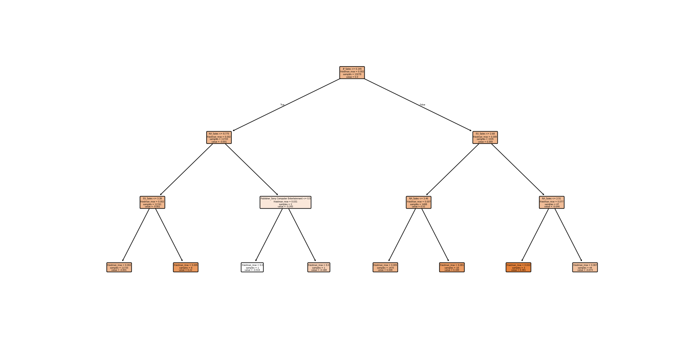
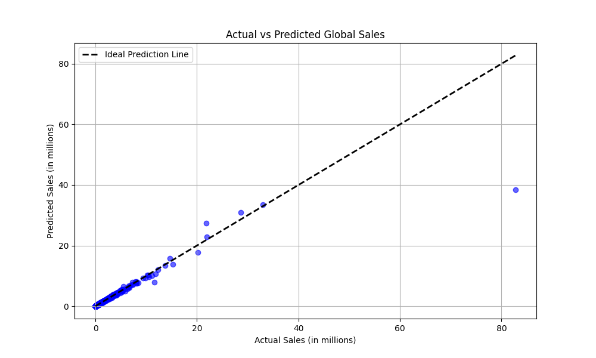

# Video Game Sales Prediction

This project focuses on predicting global video game sales using machine learning techniques. By analyzing key factors such as platform, genre, publisher, and regional sales, we aim to forecast global sales accurately, enabling better decision-making for stakeholders in the gaming industry.

## Features
- Data preprocessing for handling missing values and encoding categorical features.
- Exploratory Data Analysis (EDA) for insights into the dataset.
- Model training and evaluation using Gradient Boosting Regression.
- Feature importance analysis to identify key predictors.
- Visualization of actual vs. predicted sales for performance assessment.

## Installation

### Prerequisites
- Python 3.8 or higher
- Git (optional, for cloning the repository)

### Required Libraries
Install the required libraries using:
```bash
pip install pandas numpy matplotlib seaborn scikit-learn
```

### Dataset
Ensure the dataset is in CSV format and properly structured. Include features such as:
- `Platform`
- `Genre`
- `Publisher`
- `NA_Sales`
- `EU_Sales`
- `JP_Sales`
- `Other_Sales`
- `Global_Sales`

## Usage

1. Clone the repository:
   ```bash
   git clone https://github.com/yourusername/video-game-sales-prediction.git
   cd video-game-sales-prediction
   ```

2. Place your dataset in the project directory.

3. Run the main script:
   ```bash
   python main.py
   ```

4. View results including:
   - Feature importance
   - Actual vs. Predicted sales visualization

## Results

- **Model Performance**: High R² score, low Mean Squared Error (MSE).
- **Feature Importance**: Key features like `NA_Sales`, `EU_Sales`, and `JP_Sales` were the most influential.
- **Visualization**: Actual vs. predicted sales plotted for better understanding of model accuracy.

## Screenshots
### 1. Feature Importance


### 2. Actual vs. Predicted Sales


## Technologies Used
- **Programming Language**: Python
- **Machine Learning**: Gradient Boosting Regression (from scikit-learn)
- **Data Visualization**: Matplotlib, Seaborn

## Future Enhancements
- Experiment with additional machine learning models like XGBoost or LightGBM.
- Incorporate advanced hyperparameter tuning techniques.
- Extend analysis to include temporal trends in sales data.

## Contributing
Contributions are welcome! Please fork the repository and create a pull request for any improvements or new features.

## License
This project is licensed under the MIT License. See the [LICENSE](LICENSE) file for details.

## Acknowledgments
- Inspired by real-world applications of machine learning in sales forecasting.
- Special thanks to open-source libraries and the developer community for support.

---

